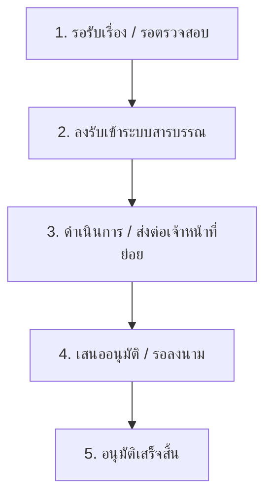

# 📖 คู่มือการใช้งานระบบสารบรรณอิเล็กทรอนิกส์ (E-Saraban)
### สำหรับผู้ดูแลระบบ (Admin) และ ผู้ใช้งานทั่วไป (User)

คู่มือนี้แนะนำฟังก์ชันการทำงาน หน้าจอหลัก เมนู และวิธีการใช้งานทุกขั้นตอนของระบบสารบรรณอิเล็กทรอนิกส์ เพื่อให้เจ้าหน้าที่และผู้ใช้บริการสามารถใช้งานระบบได้อย่างมีประสิทธิภาพสูงสุด

---

## 👥 บทบาทผู้ใช้งานในระบบ (System Roles)

ระบบสารบรรณแยกบทบาทผู้ใช้ออกเป็น 2 กลุ่มใหญ่:
1. **ผู้ใช้งานทั่วไป / บุคคลภายนอก (User/External User):** มีหน้าที่ยื่นคำร้อง, ติดตามสถานะ, ดูประวัติเอกสาร และสนทนากับเจ้าหน้าที่
2. **เจ้าหน้าที่ / ผู้ดูแลระบบ (Staff/Admin):** มีหน้าที่รับเรื่อง, ลงรับเลขรับ, ส่งต่อเรื่อง, ลงนามอนุมัติ, ตอบแชท และตั้งค่าโครงสร้างระบบ

---

## 🔑 ส่วนที่ 1: คู่มือสำหรับผู้ใช้งานทั่วไป (User Guide)

บุคคลภายนอกหรือผู้ใช้ที่เข้ามาใช้บริการยื่นส่งหนังสือ/คำขอรับการดำเนินงานต่าง ๆ

### 1.1 การสมัครสมาชิกและเข้าสู่ระบบ (Registration & Login)
1. เข้าสู่หน้าหลักของระบบสารบรรณผ่านทางเว็บบราวเซอร์
2. หากยังไม่มีบัญชี ให้เลือก **"สมัครสมาชิกใหม่" (Register)** ➡️ กรอกชื่อ-นามสกุล, Username, Email และรหัสผ่านที่ปลอดภัย จากนั้นกดสมัครสมาชิก
3. **โปรดทราบ:** บัญชีที่สมัครใหม่จะต้องได้รับการอนุมัติ (Approve) จากแอดมินหรือเจ้าหน้าที่เสียก่อน จึงจะเข้าใช้งานได้
4. เมื่อได้รับการอนุมัติแล้ว สามารถกรอก Username และรหัสผ่านเพื่อ **เข้าสู่ระบบ (Login)** ได้ทันที

---

### 1.2 การยื่นหนังสือใหม่ (Submit New Document)
1. เมื่อล็อกอินเข้ามาแล้วจะเจอ **แผงควบคุม (Dashboard)** ส่วนตัว
2. กดปุ่ม **"ยื่นเรื่องใหม่" (Submit Request)**
3. กรอกข้อมูลเอกสารให้ครบถ้วนในช่องที่มีเครื่องหมายดอกจันสีแดง `*` :
   * **ประเภทหนังสือ:** เลือกประเภท (เช่น หนังสือภายนอก, หนังสือภายใน, คำร้องทั่วไป)
   * **ความเร่งด่วน:** ปกติ, ด่วน, ด่วนที่สุด
   * **เรื่อง:** หัวข้อหรือชื่อเรื่องของหนังสือ
   * **จากหน่วยงาน/ผู้ยื่น:** ระบุชื่อผู้ส่ง (ระบบรองรับการพิมพ์คำค้นหาและเพิ่มชื่อใหม่แบบอัตโนมัติ)
   * **เรียน/เสนอ (เจ้าหน้าที่ผู้รับ):** ค้นหาและเลือกรายชื่อเจ้าหน้าที่ที่ต้องการให้ดำเนินงานส่งเรื่องไปถึง
   * **รายละเอียดเพิ่มเติม:** ข้อมูลบันทึกเสริม (ถ้ามี)
4. **การแนบเอกสาร (PDF):**
   * ระบบรองรับการอัปโหลดไฟล์ PDF ได้ครั้งละ **หลายไฟล์**
   * กดคลิกที่กรอบอัปโหลดไฟล์เพื่อเลือกไฟล์ PDF จากเครื่องของคุณ
   * รายการไฟล์ที่เพิ่งเลือกจะขึ้นเป็น **"การ์ดสีเหลือง"**
   * หากเลือกไฟล์ผิด สามารถกดปุ่ม **`X` (ยกเลิก)** เพื่อนำไฟล์ออกจากคิวอัปโหลดได้ทันที
5. กดปุ่ม **"บันทึกข้อมูล"** ระบบจะทำการอัปโหลดไฟล์ทั้งหมดเข้าไปเก็บใน Google Drive ของหน่วยงานปลายทาง และสร้างเลข Tracking Code สำหรับใช้ติดตามทันที!

---

### 1.3 การแก้ไขและลบไฟล์แนบเดิม
หากเจ้าหน้าที่แจ้งว่าต้องการเอกสารเพิ่มเติม หรือส่งไฟล์ผิดประเภท และสถานะของหนังสือยังอยู่ในขั้นรอรับเรื่อง:
1. เข้าไปที่เมนู **ประวัติการยื่นคำร้อง** ➡️ คลิกเลือกหนังสือเล่มที่ต้องการแก้ไข
2. กดปุ่ม **"แก้ไขเอกสาร"**
3. รายการไฟล์เดิมที่เคยอัปโหลดไว้แล้วจะขึ้นแสดงเป็น **"การ์ดสีน้ำเงิน"**
4. หากต้องการลบไฟล์แนบใบใดใบหนึ่งออก ให้กดปุ่ม **`X` (ลบ)** ที่การ์ดไฟล์แนบเดิมใบนั้น
5. หากต้องการเพิ่มไฟล์ใหม่ ให้คลิกเลือกไฟล์แนบใบใหม่เพิ่มเข้ามา (แสดงเป็นแถบสีเหลือง) จากนั้นกด **"บันทึกข้อมูล"** เพื่อทำการเปลี่ยนแปลงข้อมูลและอัปโหลดไฟล์ใหม่เข้าสู่ระบบ

---

### 1.4 การติดตามสถานะ (Document Tracking)

#### ช่องทางที่ 1: ติดตามผ่านประวัติของสมาชิก (ล็อกอิน)
* เมื่อล็อกอินเข้ามา แดชบอร์ดจะแสดงการ์ดสรุปจำนวนสถานะหนังสือ (ทั้งหมด, รอรับเรื่อง, กำลังดำเนินการ, เสร็จสิ้น)
* ด้านล่างจะมีตารางรายการหนังสือทุกเล่มที่คุณเคยยื่น สามารถตรวจสอบสถานะ และคลิกดูรายละเอียดเพื่อเปิดดูไฟล์ต้นฉบับ หรือเปิดดูไฟล์ที่ผ่านการอนุมัติแล้วได้ทันที

#### ช่องทางที่ 2: ติดตามโดยไม่ต้องล็อกอิน (Public Track Search)
1. สำหรับผู้ใช้ทั่วไปที่ต้องการความรวดเร็ว ให้คลิกปุ่ม **"ค้นหา/ติดตามสถานะ (ไม่ต้องล็อกอิน)"** ที่หน้าเข้าสู่ระบบหลัก
2. กรอกรหัส **Tracking Code** (เช่น `TRK-123456`) หรือกรอก **เลขที่หนังสือ** แล้วกด **ค้นหา**
3. ระบบจะแสดงการ์ดข้อมูลเอกสาร รวมถึง Timeline การดำเนินการว่าเรื่องถึงขั้นตอนไหน และใครเป็นผู้ดูแลอยู่ในปัจจุบัน

---

### 1.5 ระบบพูดคุยและสอบถามเจ้าหน้าที่ (Chat System)
1. ในหน้าแดชบอร์ด ให้คลิกปุ่ม **"ติดต่อเจ้าหน้าที่" (Chat with Staff)**
2. คุณสามารถเปิดกล่องแชทพิมพ์ข้อความสอบถาม แจ้งปัญหา หรือปรึกษาเกี่ยวกับเอกสารที่ส่งไปหาเจ้าหน้าที่ได้ทันทีในแบบเรียลไทม์

---

## 👑 ส่วนที่ 2: คู่มือสำหรับเจ้าหน้าที่และผู้ดูแลระบบ (Staff & Admin Guide)

แดชบอร์ดหลังบ้านหลักของเจ้าหน้าที่สารบรรณ ซึ่งมีสิทธิ์เข้าถึงเครื่องมือการทำงานแบบครบวงจร

### 2.1 หน้าจอแดชบอร์ดหลักและเมนูการทำงาน
เมื่อเจ้าหน้าที่ล็อกอินเข้ามา จะพบเมนูควบคุมหลักทางฝั่งซ้ายมือ:
* **รายการหนังสือ:** แสดงตารางข้อมูลหนังสือทั้งหมดในระบบ พร้อมระบบค้นหาอัจฉริยะ (สามารถค้นหาจากชื่อเจ้าหน้าที่ผู้รับ, Tracking Code, หัวข้อเรื่อง, และผู้ยื่นส่งได้)
* **กล่องข้อความพูดคุย:** แผงแชทส่วนกลางเพื่อพูดคุยตอบคำถามกับสมาชิก
* **รายงานสถิติ:** แสดงแผนภูมิข้อมูลและผลสรุป เช่น ยอดรวมเอกสารจำแนกรายวัน รายเดือน หรือแยกตามประเภท
* **การตั้งค่าระบบ:** แผงควบคุมสิทธิ์การเข้าถึง และการเชื่อมต่อ Google Drive
* **การจัดการผู้ใช้งาน:** แสดงรายชื่อสมาชิกทั้งหมด อนุมัติผู้สมัครใหม่ และการปรับเปลี่ยนสิทธิ์ผู้ใช้

---

### 2.2 ขั้นตอนการดำเนินงานเอกสาร (Document Workflow)

เมื่อสมาชิกยื่นหนังสือเข้ามาในระบบ เจ้าหน้าที่ต้องดำเนินงานผ่านขั้นตอนมาตรฐาน 5 ขั้นตอน (เปลี่ยนสถานะอัตโนมัติ):

1. **ขั้นตอนการรับเรื่อง (Accept/Verify):**
   * ไปที่หนังสือที่ยื่นเข้ามาใหม่ (สถานะ: *รอตรวจสอบ*) คลิกเข้าไปอ่านข้อมูล ตรวจสอบไฟล์แนบ PDF ทุกใบ
   * ตรวจสอบว่าถูกต้องหรือไม่ หากถูกต้องให้กดปุ่ม **"ลงรับเรื่อง (Register)"** ระบบจะให้รันเลขหนังสือรับโดยอัตโนมัติ
2. **ขั้นตอนการส่งต่อดำเนินงาน (Forward):**
   * หากจำเป็นต้องส่งต่อไปให้แผนกย่อยอื่น ๆ หรือเจ้าหน้าที่ภายในดำเนินการต่อ ให้คลิกปุ่ม **"ส่งต่อ (Forward)"** และระบุรายชื่อเจ้าหน้าที่ที่ต้องการมอบหมายงานให้ดำเนินการ
3. **ขั้นตอนการเสนอเซ็นและลงนามอนุมัติ (Approve & Signature):**
   * เมื่อดำเนินการเสร็จสิ้นเรียบร้อย ให้ไปที่หน้าเอกสารและกดปุ่ม **"อนุมัติเอกสาร" (Approve & Sign)**
   * เจ้าหน้าที่สามารถเลือกอัปโหลดไฟล์ PDF ใบที่ผ่านการลงลายมือชื่อและประทับตราอนุมัติเรียบร้อยแล้ว (Approved PDF) เข้าระบบ
   * กดบันทึก สถานะของเอกสารจะถูกอัปเดตเป็น **"เสร็จสมบูรณ์/อนุมัติแล้ว"** ทันที และระบบจะเปิดสิทธิ์ให้ผู้ยื่นเรื่องดาวน์โหลดเอกสารที่ได้รับการลงนามอนุมัติกลับไปใช้งานได้

---

### 2.3 การอนุมัติผู้ใช้งานใหม่ (Approve Users)
1. ไปที่เมนู **"การจัดการผู้ใช้งาน" (User Management)**
2. ระบบจะแบ่งรายชื่อสมาชิกออกเป็นแท็บ: **สมาชิกที่รอการอนุมัติ (Pending Setup)** และ **สมาชิกทั้งหมด (All Users)**
3. ในแท็บที่รอการอนุมัติ ให้ตรวจสอบรายชื่อและสิทธิ์ที่เขาร้องขอ จากนั้นกดปุ่ม **"อนุมัติบัญชี" (Approve)** เพื่อเปิดใช้งานสิทธิ์ของเขา
4. คุณสามารถปรับเปลี่ยนยศสิทธิ์ (Role) ของสมาชิกแต่ละคน เช่น เปลี่ยนจากผู้ใช้ธรรมดา (`User`) ให้เป็นเจ้าหน้าที่ฝ่ายบริหารงานทั่วไป (`Staff`) ได้จากหน้านี้เช่นเดียวกัน

---

### 2.4 ระบบเชื่อมต่อจัดเก็บไฟล์กับ Google Drive
นี่คือระบบอัจฉริยะที่แอดมินระดับบริหารจัดการเท่านั้นที่จะเข้าถึงได้:
1. ไปที่เมนู **"การตั้งค่าระบบ" (System Configuration)** ➡️ เลือกแท็บ **"จัดเก็บไฟล์แนบ (Google Drive)"**
2. กรอกคีย์ของหน่วยงาน ได้แก่ **Client ID**, **Client Secret** และ **Target Folder ID**
3. กดปุ่ม **"บันทึกค่าและเชื่อมต่อ Google Drive"**
4. ล็อกอินผ่านหน้าต่าง Google ขององค์กรเพื่อยืนยันการขอสิทธิ์
5. ระบบจะขึ้นสถานะ **"เชื่อมต่อ Google Drive สำเร็จ"** เป็นอันเสร็จสิ้นขั้นตอนการทำงานครั้งแรก โดยที่เจ้าหน้าที่และคนอื่น ๆ ไม่ต้องกดเชื่อมต่อนี้อีกเลยตลอดการใช้งานระบบ

---
